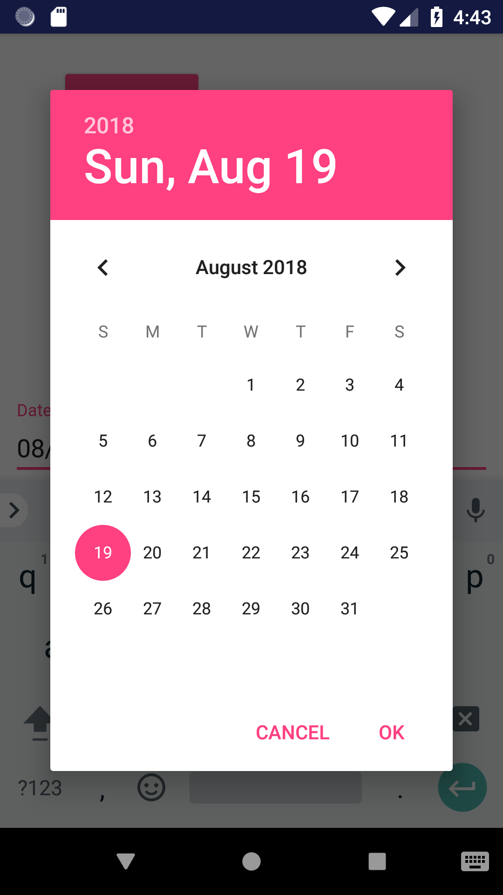

I recently ran into a situation in which I had to launch a date-picker fragment from a fragment. I had used the date-picker before, calling it from an activity and implementing an interface. Calling from a fragment can be handled the same way, but the response goes to the controlling activity. In this instance I wanted the result to go directly to the calling fragment. So this is what I came up with.


### The Fragment calling the DatePicker

The most important part is the line `newFragment.setTargetFragment(MyFragment.this, REQUEST_CODE);`. The target lets the new fragment know where to report back to and the REQUEST_CODE is just an integer used for identification.

The date selected in the date-picker is received in the onActivityResult method.

```java
// MyFragment.java

public class MyFragment extends Fragment {

    EditText dateOfBirthET;
    String selectedDate;
    public static final int REQUEST_CODE = 11; // Used to identify the result

    private OnFragmentInteractionListener mListener;

    public MyFragment() {
        // Required empty public constructor
    }

    public static MyFragment newInstance() {
        MyFragment fragment = new MyFragment();
        return fragment;
    }

    @Override
    public void onCreate(Bundle savedInstanceState) {
        super.onCreate(savedInstanceState);
    }

    @Override
    public View onCreateView(LayoutInflater inflater, ViewGroup container,
                             Bundle savedInstanceState) {
        // Inflate the layout for this fragment
        View view = inflater.inflate(R.layout.fragment_my, container, false);
        dateOfBirthET = view.findViewById(R.id.dateOfBirthET);

        // get fragment manager so we can launch from fragment
        final FragmentManager fm = ((AppCompatActivity)getActivity()).getSupportFragmentManager();

        // Using an onclick listener on the editText to show the datePicker
        dateOfBirthET.setOnClickListener(new View.OnClickListener() {
            @Override
            public void onClick(View v) {
                // create the datePickerFragment
                AppCompatDialogFragment newFragment = new DatePickerFragment();
                // set the targetFragment to receive the results, specifying the request code
                newFragment.setTargetFragment(MyFragment.this, REQUEST_CODE);
                // show the datePicker
                newFragment.show(fm, "datePicker");
            }
        });

        return view;
    }

    @Override
    public void onActivityResult(int requestCode, int resultCode, Intent data) {
        // check for the results
        if (requestCode == REQUEST_CODE && resultCode == Activity.RESULT_OK) {
            // get date from string
            selectedDate = data.getStringExtra("selectedDate");
            // set the value of the editText
            dateOfBirthET.setText(selectedDate);
        }
    }

    @Override
    public void onAttach(Context context) {
        super.onAttach(context);
        if (context instanceof OnFragmentInteractionListener) {
            mListener = (OnFragmentInteractionListener) context;
        } else {
            throw new RuntimeException(context.toString()
                    + " must implement OnFragmentInteractionListener");
        }
    }

    @Override
    public void onDetach() {
        super.onDetach();
        mListener = null;
    }

    public interface OnFragmentInteractionListener {
        // TODO: Update argument type and name
        void onFragmentInteraction(Uri uri);
    }
}
```


### DatePickerFragment

Here is the code for the date-picker fragment. It is in the OnDateSet method that the date is sent back to the target fragment.

```java
// DatePickerFragment.java

public class DatePickerFragment extends AppCompatDialogFragment implements DatePickerDialog.OnDateSetListener {
    private static final String TAG = "DatePickerFragment";
    final Calendar c = Calendar.getInstance();

    @Override
    public Dialog onCreateDialog(Bundle savedInstanceState) {

        // Set the current date as the default date
        final Calendar c = Calendar.getInstance();
        int year = c.get(Calendar.YEAR);
        int month = c.get(Calendar.MONTH);
        int day = c.get(Calendar.DAY_OF_MONTH);

        // Return a new instance of DatePickerDialog
        return new DatePickerDialog(getActivity(), DatePickerFragment.this, year, month, day);
    }

    // called when a date has been selected
    public void onDateSet(DatePicker view, int year, int month, int day) {
        c.set(Calendar.YEAR, year);
        c.set(Calendar.MONTH, month);
        c.set(Calendar.DAY_OF_MONTH, day);
        String selectedDate = new SimpleDateFormat("MM/dd/yyyy", Locale.ENGLISH).format(c.getTime());

        Log.d(TAG, "onDateSet: " + selectedDate);
        // send date back to the target fragment
        getTargetFragment().onActivityResult(
                getTargetRequestCode(),
                Activity.RESULT_OK,
                new Intent().putExtra("selectedDate", selectedDate)
        );
    }
}
```


All of the code for this example can be found on github at [DatePickerExample](https://github.com/blehr/DatePickerExample) 
If you have any questions or have any suggestions on how to improve the code, I would love to hear them.