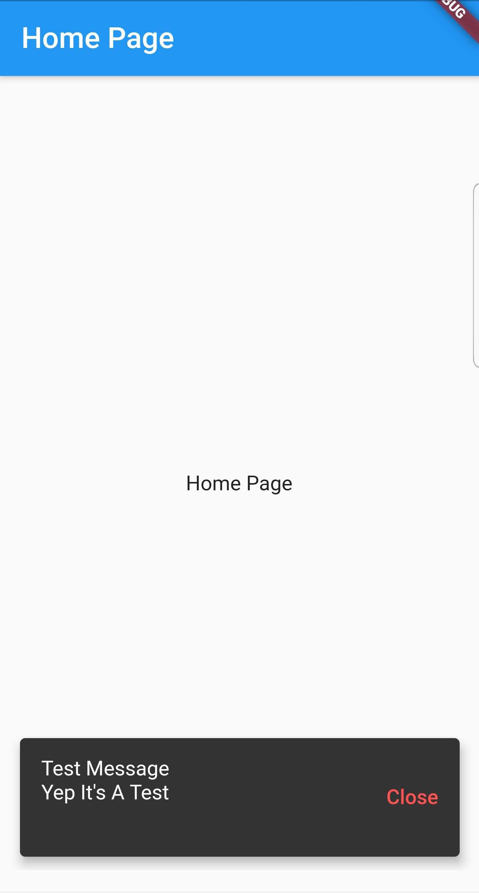

I recently wanted to add Firebase Messaging to enable push notifications to an application. Overall, the process worked well, but there was one hiccup I that I ran into.

###How to display the messages while the app was open.

I needed a way to receive the message and then be able to display it regardless of where the user was in the app. If you have developed Flutter apps then you can see my problem. Things are generally easy when events are handled on a particular screen and contained conveniently in a particular widget tree. When some thing needs to live outside of this, things get interesting.

###So how did I solve this problem?

I decided I wanted to be able to place in-coming messages that triggered the onMessage listening callback, into a stream so that I could simply read the data as it came in. I created a MessageStream class as a singleton that contained a stream using behavior subject from rxdart.


```dart
import 'dart:async';
import 'package:rxdart/rxdart.dart';

class MessageStream {
  MessageStream._internal();

  static final MessageStream _instance = MessageStream._internal();

  static MessageStream get instance {
    return _instance;
  }

  final _message = BehaviorSubject<Map<String, dynamic>>();
  Stream<Map<String, dynamic>> get messageStream => _message.stream;

  void addMessage(Map<String, dynamic> msg) {
    _message.add(msg);
    return;
  }


  void dispose() {
    _message.close();
  }
}

```

Next I had to initialize the Firebase Messaging Client and register the listeners. For this, I created another singleton to encapsulate this functionality. This FirebaseNotificationService places the in-coming message into the MessageStream.

```dart
import 'dart:io';
import 'package:firebase_messaging/firebase_messaging.dart';
import 'package:firebaseauth_flutter/apis/api.dart';
import 'package:firebaseauth_flutter/providers/message_stream.dart';

class FirebaseNotificationService {
  FirebaseNotificationService._internal() {
    // save the client so that it can be used else where
    _firebaseMessaging = FirebaseMessaging();
    // setup listeners
    firebaseCloudMessagingListeners();
  }


  static final FirebaseNotificationService _instance =
      FirebaseNotificationService._internal();

  static FirebaseNotificationService get instance {
    return _instance;
  }

  Api api = Api.instance;

  // get the message stream
  MessageStream _messageStream = MessageStream.instance;
  FirebaseMessaging _firebaseMessaging;

  // getter for firebase messaging client
  get firebaseMessaging => _firebaseMessaging;

  // method for getting the messaging token
  void sendDeviceToken() {
    _firebaseMessaging.getToken().then((token) {
      print("MESSAGING TOKEN: " + token);
      api.sendDeviceToken(token: token);
    });
  }

  void firebaseCloudMessagingListeners() {
    if (Platform.isIOS) getIOSPermission();

    _firebaseMessaging.configure(
      onMessage: (Map<String, dynamic> message) async {
        print('on message $message');

        // add message to stream
        _messageStream.addMessage(message);
      },
      onResume: (Map<String, dynamic> message) async {
        print('on resume $message');
      },
      onLaunch: (Map<String, dynamic> message) async {
        print('on launch $message');
      },
    );
  }

  void getIOSPermission() {
    _firebaseMessaging.requestNotificationPermissions(
        IosNotificationSettings(sound: true, badge: true, alert: true));
    _firebaseMessaging.onIosSettingsRegistered
        .listen((IosNotificationSettings settings) {
      print("Settings registered: $settings");
    });
  }
}

```

The messaging service is to be instantiated as early as possible in the app life cycle so that it will be available when the app is launched from a notification. I handle this in my main.dart while creating the typical MyApp component.

```dart
import 'package:firebaseauth_flutter/pages/splash_page.dart';
import 'package:firebaseauth_flutter/services/firebase_notification_service.dart';
import 'package:flutter/material.dart';

void main() => runApp(MyApp());

class MyApp extends StatelessWidget {
  MyApp() {
    FirebaseNotificationService.instance;
  }

  @override
  Widget build(BuildContext context) {
    return MaterialApp(
      title: 'Flutter Demo',
      theme: ThemeData(
        primarySwatch: Colors.blue,
      ),
      home: SplashPage(),
    );
  }
}

```

###Sending the messaging token to the server.

I handle sending the messaging token to the server after a user signs in. I need the user so that I can associate the token with them. I also use this time to ask for permissions on iOS.

```dart
 void _handleSignIn() async {
    firebaseAuthService.googleSignIn().then((FirebaseUser user) {
      if (user != null) {

        FirebaseNotificationService.instance.sendDeviceToken();
        FirebaseNotificationService.instance.getIOSPermission();

        Navigator.pushReplacement(
            context, MaterialPageRoute(builder: (context) => HomePage()));
      } else {
        print(user);
      }
    }).catchError((e) {
      print(e.toString());
    });
  }
```

###So how do I show the message while the user is in the app?

For this, I created a FirebaseMessageWrapper which is a stateful widget that will handle listening to the message stream and displaying a snackbar to the user. The snackbar requires a Scaffold to be in the widget tree, so I wrap the body widgets of any scaffold with this wrapper.

```dart
import 'package:firebaseauth_flutter/providers/message_stream.dart';
import 'package:flutter/material.dart';

class FirebaseMessageWrapper extends StatefulWidget {
  final Widget child;

  FirebaseMessageWrapper(this.child);
  @override
  _FirebaseMessageWrapperState createState() => _FirebaseMessageWrapperState();
}

class _FirebaseMessageWrapperState extends State<FirebaseMessageWrapper> {
  MessageStream _messageStream = MessageStream.instance;

  @override
  void dispose() {
    super.dispose();
  }

  @override
  Widget build(BuildContext context) {
    return StreamBuilder(
        initialData: null,
        stream: _messageStream.messageStream,
        builder: (BuildContext context,
            AsyncSnapshot<Map<String, dynamic>> snapshot) {
          Map<String, dynamic> msg = snapshot.data;
          if (msg != null) {
            print(msg);
            WidgetsBinding.instance
                .addPostFrameCallback((_) => _showMessage(msg));
            // adding a null stops the previous message from being displayed again
            _messageStream.addMessage(null);
          }
          return widget.child;
        });
  }

  void _showMessage(Map<String, dynamic> message) {

    SnackBar bar = SnackBar(
      behavior: SnackBarBehavior.floating,
      duration: Duration(seconds: 10),
      action: SnackBarAction(
        label: "Close",
        textColor: Colors.redAccent,
        onPressed: () => Scaffold.of(context).hideCurrentSnackBar(),
      ),
      content: Padding(
        padding: const EdgeInsets.only(bottom: 25.0),
        child: Column(
          mainAxisSize: MainAxisSize.min,
          crossAxisAlignment: CrossAxisAlignment.start,
          children: <Widget>[
            Text(message['notification']["title"]),
            Text(message['notification']["body"]),
          ],
        ),
      ),
    );

    Scaffold.of(context)
      ..hideCurrentSnackBar()
      ..showSnackBar(bar);
  }
}

```

Here is an example of it in use.

```dart
import 'package:firebaseauth_flutter/widgets/firebase_message_wrapper.dart';
import 'package:flutter/material.dart';

class HomePage extends StatefulWidget {
  HomePage({Key key}) : super(key: key);

  _HomePageState createState() => _HomePageState();
}

class _HomePageState extends State<HomePage> {

  @override
  Widget build(BuildContext context) {
    return Scaffold(
      appBar: AppBar(
        title: Text("Home Page"),
      ),
      body: FirebaseMessageWrapper(
        Center(
          child: Text('Home Page'),
        ),
      ),
    );
  }
}


```

And here is how it looks.



I'm sure there are other ways of handling this problem, but this one seems straight forward and is working for me. Let me know what you think in the comments below and feel free to share any other ways you have handled this situation in your own apps.