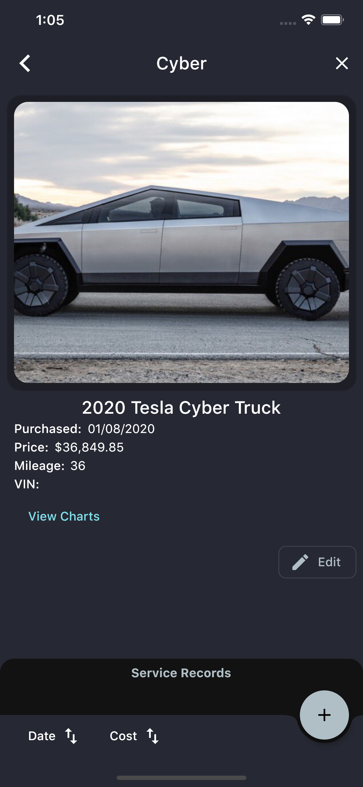
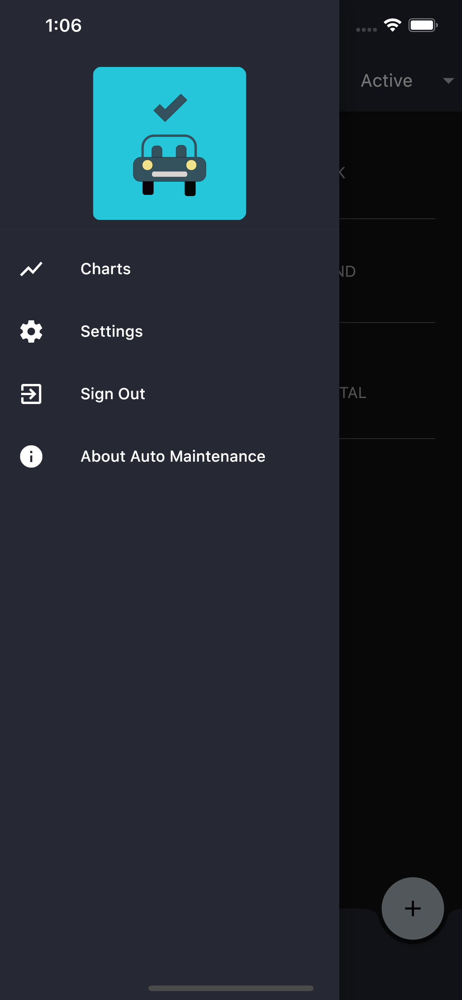

  

    
  

  

    
  

  

    
  

Face it, having multiple vehicles which are always in need a repair makes it difficult to remember which vehicle had what repair and when.

Didn't I just replace the brakes on the van over the summer?

I know that the battery was changed in the car last winter, or was it the winter before?

These are things you will want to be able to one day remember, but we both know you won't!

### The Solution

Now you can download [Auto Log](https://play.google.com/store/apps/details?id=com.brandonlehr.autoMaintenance) for Android or [Auto Maintenance](https://apps.apple.com/app/id1489955489) for iOS. The app allows you track your vehicles and their repairs quickly and conveniently.

  

    
    

  

    
  

  

    
    

  

    
  

  

    
    

  

    
  

For added convenience, the app offers a yearly subscription to save images of your bills and receipts and attach them to a service record. Who wants to keep paper copies? Now you can view or download them at any time!

  

    
    

  

    
  

Give it a try and let me know what you think! I would love to hear any suggestions to make the app better!

  

    
  

  

    
  

