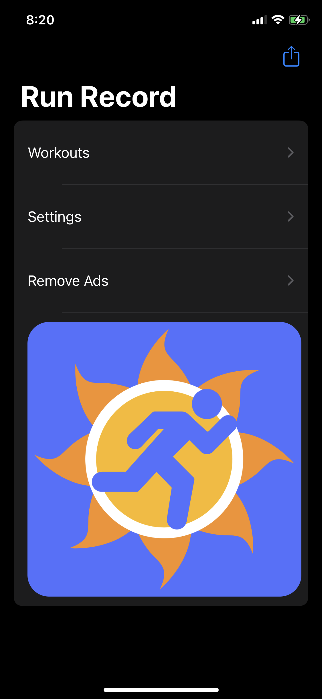
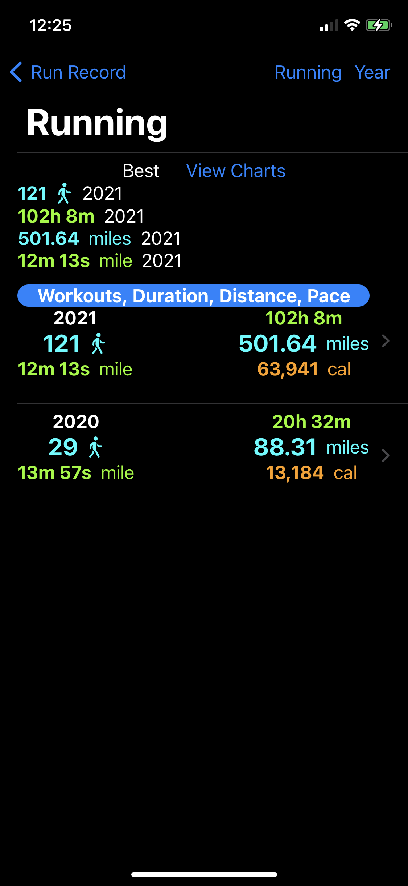
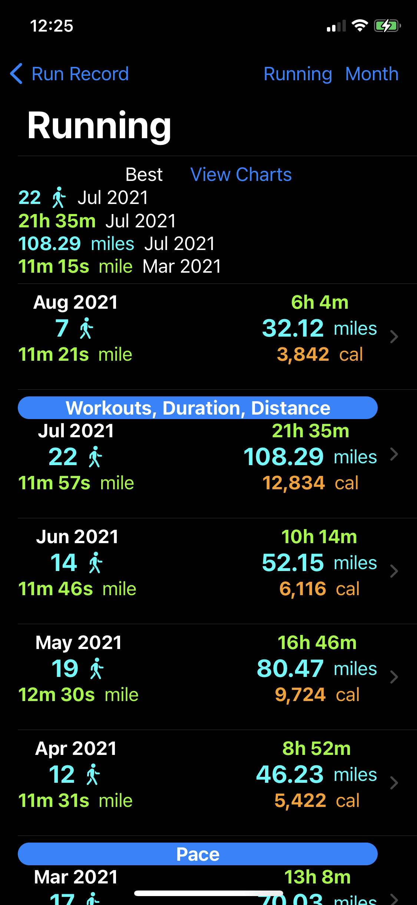
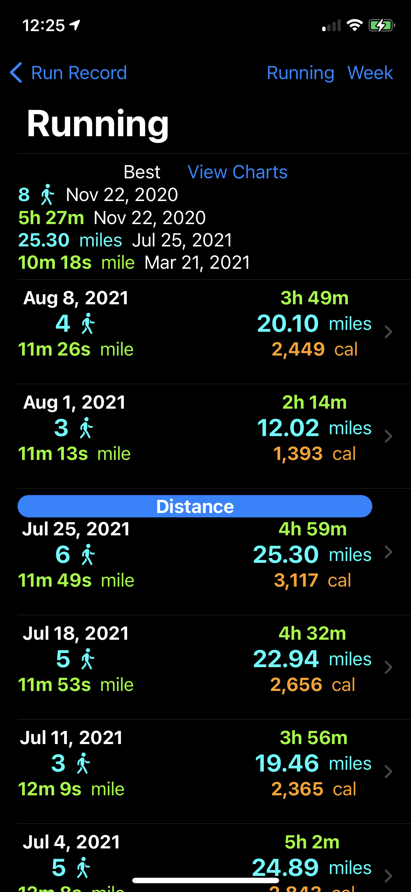
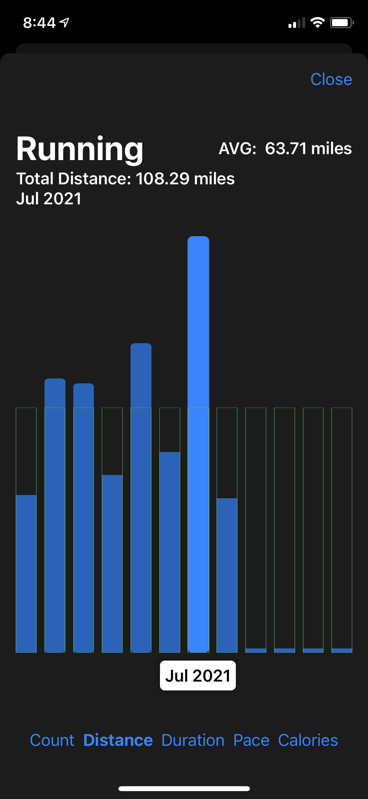

Since getting an Apple Watch, I record all of my workouts and store the data in the Apple Health app.

One problem I have run into, is that it is difficult to review the results of those workouts in a way that I can compare progress and volume easily, whether it be **year to year**, **month to month**, or **week to week**.

# Meet Run Record

  

      
  

Run Record allows me to see relevant stats, grouped in logical intervals.

## Workouts include:

- Running
- Walking
- Hiking
- Cycling

## Stats include:

- Total # of Workouts
- Total Duration
- Total Distance - ( kilometers or miles )
- Total Energy Burned
- Average Pace - ( kilometers or miles )

## View by:

- Year
- Month
- Week

## See PR's Quickly

At the top of each list, is a summary of all of the best values for the selected time frame and each item represented is tagged for ease of locating within the list.

## Visualize

If lists aren't your thing, view the current stats in a chart choosing which metric you wish to see!

## Safety

All data is read from the Apple Health App and never leaves your phone!

  

    
Home Page

    
    

  

    
Year

    
  

  

    
Month

    
    

  

  
Week

    
  

    

      
Charts

    
    

  

    
Enjoy Ad Free

    
  

## Something Missing?

If you have an idea for a feature or use case for the app, please let me know!

    

