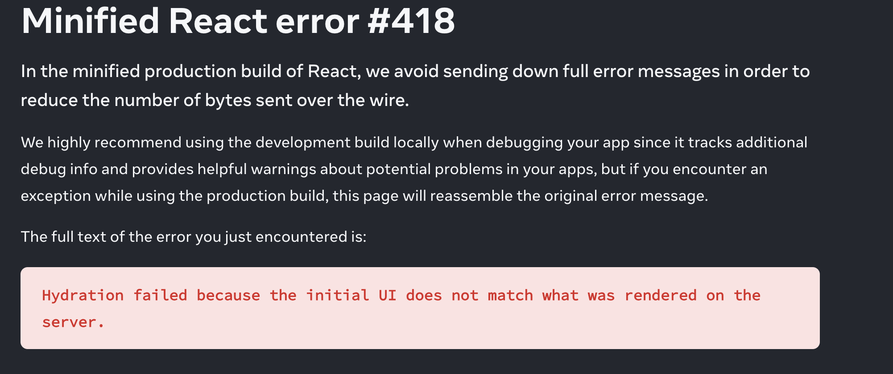
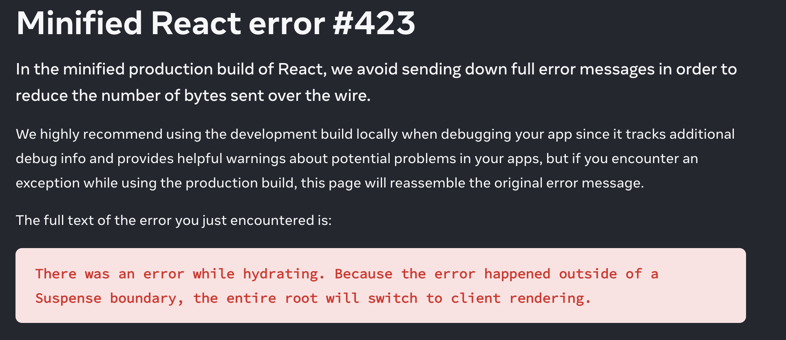

I recently re-wrote my app [Alpaca Tracker](/alpaca/i-built-this/2018/09/02/alpaca-tracker) with the [Remix](https://remix.run/) framework. I'll write more on that later, but for now I want to talk about the troubles I faced while trying to incorporate Google AdSense Ads. ( I know ads suck, but hosting costs money!!! ).





While researching this, most problems that people were encountering had to do with browser extensions injecting elements while rendering. This caused the problem where react would resolve to client side rendering. The most popular solution was to upgrade to the 18.3.0-canary versions. These seem to have fixed the extension problem, but not the issue I was facing.

So, I figured if the problem was that the client render was different then the server, why not wait till after the first render to download the AdSense script and inject ads?

I removed the script tag from the head of the document ( root.tsx in remix ). Then I created an ad component than would handle creating and appending the script to the document head as well pushing the ad to the adsbygoogle array. The code runs in a useEffect hook, with a dependency on location.key.

The `<ins></ins>` code from AdSense is wrapped in a div with a key of location.key so that it will rerender appropriately wit each location change.

```javascript
 const location = useLocation();

  useEffect(() => {
    handleAds();
  }, [location.key]);

  const handleAds = () => {
    if (!document.getElementById("adsbygoogleaftermount")) {
      var script = document.createElement("script");
      script.id = "adsbygoogleaftermount";
      script.type = "text/javascript";
      script.async = true;
      script.src =
        "https://pagead2.googlesyndication.com/pagead/js/adsbygoogle.js";
      document.head.appendChild(script);
    }
    window.adsbygoogle = window.adsbygoogle || [];
    window.adsbygoogle.push({});
  };

  return (
    <div className="mt-4">
      <div key={location.key}> // <-- this is important
        <ins
          className="adsbygoogle"
          style={{ display: "block" }}
          data-ad-client="ca-pub-xxxxxxxxxxxxxxxx"
          data-ad-slot="xxxxxxxxxx"
          data-ad-format="auto"
          data-full-width-responsive="true"
        ></ins>
      </div>
  )
}
```

This is working perfectly on [alpacatracker.com](https://alpacatracker.com). It works with placed ads as well as auto ads.
