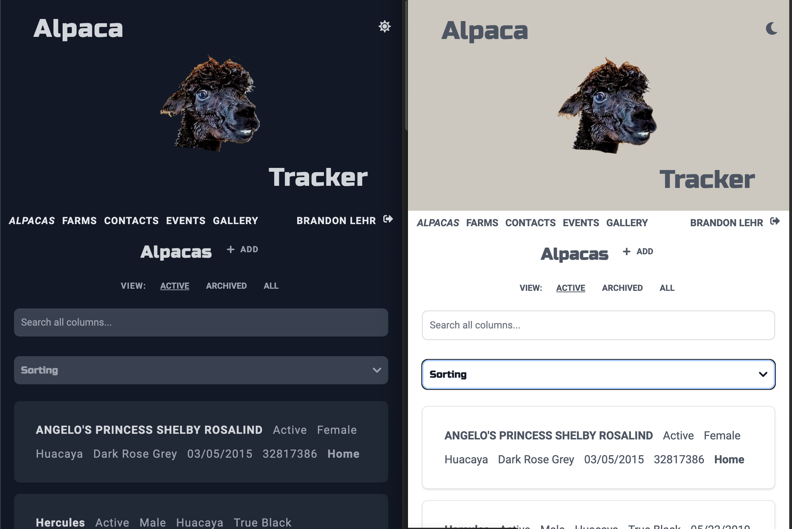

The [Alpaca Tracker](https://alpacatracker.com) has been completely rebuilt from the ground up. The website and mobile apps have all been implemented with light and dark themes.

The website features an improved responsive design for better viewing on smaller devices. The biggest being the switch from tables to a list tile view.

## New Features

Alpacas now have added fields of tag number and note.

Alpacas, Farms, and Contacts have an active property. This allows for archiving those items for whom you want to keep all of the previous records, but no longer will be using. Such as selling an alpaca. The old records remain, but when marked as archived, this alpaca will no longer appear as an option when creating new events.

I'm hoping this update makes using the app a more enjoyable experience.

Any questions or comments, please reach out.
